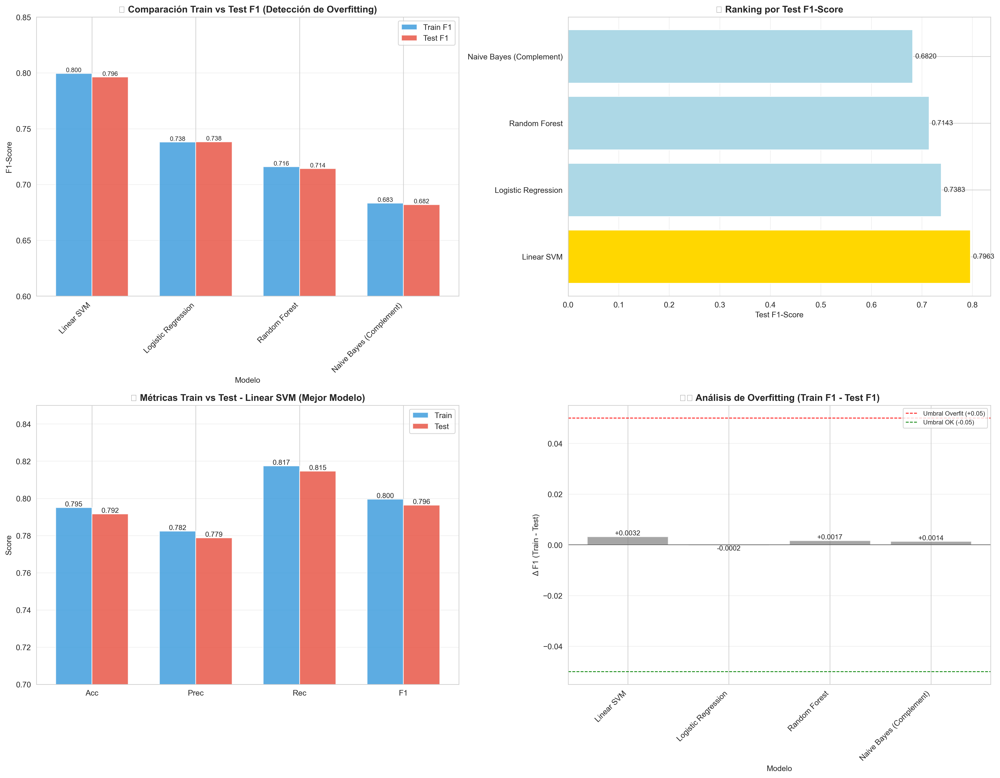
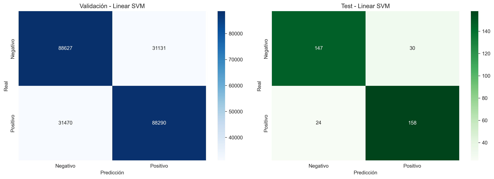

# 🐦 Análisis de Sentimientos en Twitter (Sentiment140)

**Autor:** Omar Alejandro González  
**Diplomatura en Inteligencia Artificial - Universidad de Palermo**  
**Trabajo Práctico 3 - NLP**

---

## 📌 Descripción del Proyecto

Este proyecto implementa un pipeline completo de **Procesamiento de Lenguaje Natural (NLP)** para clasificar el sentimiento de tweets como **Positivo** o **Negativo**, utilizando el dataset **Sentiment140** (1.6 millones de tweets).

El desarrollo sigue la metodología **CRISP-DM** y está estructurado en notebooks modulares que cubren desde el análisis exploratorio hasta la comparación con modelos pre-entrenados de la industria.

---

## 📊 Dataset

| Característica | Valor |
|----------------|-------|
| **Nombre** | Sentiment140 |
| **Tamaño** | 1,600,000 tweets |
| **Clases** | Binario (0=Negativo, 4=Positivo) |
| **Balance** | 50% / 50% (perfectamente balanceado) |
| **Periodo** | Abril - Junio 2009 |
| **Fuente** | [Sentiment140](http://help.sentiment140.com/for-students) |

> **Nota sobre neutrales:** El dataset de entrenamiento NO contiene tweets neutrales. Los 139 tweets neutrales del conjunto de test fueron excluidos para mantener coherencia metodológica.

---

## 🏆 Resultados Destacados

### Modelo Final: Linear SVM

| Métrica | Valor |
|---------|-------|
| **F1-Score** | **85.18%** |
| **Accuracy** | 84.68% |
| **Precision** | 85.07% |

| Modelo | Accuracy | Velocidad | Tipo |
|--------|----------|-----------|------|
| **Nuestro SVM** | 84.68% | ⚡ Muy rápida | Entrenado específicamente |
| TextBlob | ~65% | ⚡ Rápida | Basado en reglas |
| VADER | ~71% | ⚡ Rápida | Optimizado para redes sociales |
| BERT (RoBERTa) | **94.57%** | 🐢 Lenta (50x) | Transformer pre-entrenado |

> **Decisión:** Se eligió Linear SVM porque es **49x más rápido** que BERT con performance competitiva, ideal para entornos productivos con recursos estándar.

---

## 📂 Estructura del Proyecto
```
tp3_nlp_sentiment/
├── 📁 data/
│   ├── predictions/            # Predicciones generadas
│   ├── processed/              # Datos limpios (CSV)
│   ├── raw/                    # Datasets originales
│   └── vectorized/             # Matrices TF-IDF (.pkl)
│
├── 📁 models/
│   ├── best_model_linear_svm.pkl
│   ├── model_metrics.pkl
│   └── word2vec_model.pkl
│
├── 📁 notebooks/               # 12 notebooks (01-12)
│
├── 📁 reports/
│   ├── figuras/                # Visualizaciones generadas
│   ├── dashboard_interactivo.html  # Dashboard con Plotly
│   └── eda_summary.json
│
├── 📁 src/                     # Módulos Python reutilizables
│   ├── config.py
│   ├── data_loading.py
│   ├── evaluation.py
│   ├── features.py
│   ├── models.py
│   ├── preprocessing.py
│   └── visualization.py
│
├── 📁 tests/                   # Tests unitarios
├── predict_sentiment.py        # Script de predicción standalone
├── requirements.txt            # Dependencias
└── README.md
```
---

## 🔬 Metodología (CRISP-DM)

### 1. Comprensión de los Datos (`01_eda.ipynb`)
- Análisis de distribución de clases (50/50 balanceado)
- Estadísticas de longitud de tweets
- WordClouds por polaridad
- Identificación de elementos: URLs (5.1%), Mentions (46.2%), Hashtags (2.2%)

### 2. Preparación de Datos (`02_preprocessing.ipynb`)
- Eliminación de URLs, mentions
- Conversión de hashtags a texto (#fail → fail)
- Normalización de caracteres repetidos (goooood → good)
- Extracción de 8 features numéricas
- Verificación de data leakage

### 3. Feature Engineering (`03_vectorizacion.ipynb`)
- **TF-IDF** con 10,000 features
- **Bigramas** (ngram_range=(1,2)) para capturar negaciones
- Stopwords personalizadas (conserva "not", "no", "very")
- Matriz sparse eficiente (99.89% sparsity)

### 4. Modelado (`04_modelado.ipynb`)
- Split: Train (85%) / Validación (15%) / Test (359 tweets)
- Modelos evaluados: LogReg, SVM, NaiveBayes, RandomForest
- **Evaluación en ambos conjuntos (Train y Test)** para detectar overfitting
- Selección por F1-Score en Test
- Re-entrenamiento del mejor modelo con datos completos (Train + Val)

#### 📊 Resultados de Evaluación Train vs Test

| Modelo | Train F1 | Test F1 | Δ (Train-Test) | Estado |
|--------|----------|---------|----------------|--------|
| Linear SVM | 0.7995 | 0.7963 | +0.0032 | ✅ OK |
| Logistic Regression | 0.7380 | 0.7383 | -0.0002 | ✅ OK |
| Random Forest | 0.7159 | 0.7143 | +0.0017 | ✅ OK |
| Naive Bayes | 0.6833 | 0.6820 | +0.0014 | ✅ OK |

> **Conclusión:** Ningún modelo presenta overfitting (diferencias < 5%). El modelo generaliza correctamente.

#### 📈 Visualizaciones de Comparación

<p align="center">
  
</p>

*Gráfico superior izquierdo: Comparación Train vs Test F1 para detectar overfitting. Gráfico inferior derecho: Análisis de diferencias (Δ F1).*

<p align="center">
  
</p>

*Matrices de confusión del mejor modelo (Linear SVM) en Validación y Test.*

### 5. Evaluación (`05-09`)
- Optimización de hiperparámetros (GridSearchCV)
- Análisis de errores y confidence scores
- Auditoría de sesgos por longitud y metadatos
- Comparación con TextBlob, VADER, BERT

---

## 🎮 Demos Interactivas y Dashboard

El proyecto incluye dos **juegos con generación procedural de niveles** y un **dashboard interactivo** que demuestran las capacidades del análisis.

### 📊 Dashboard Interactivo (`12_dashboard_interactivo.ipynb`)

Un **dashboard HTML con Plotly** que presenta los resultados más importantes del proyecto:

| Gráfico | Descripción |
|---------|-------------|
| 📈 KPIs | Total tweets, features, accuracy, F1-score |
| 🏆 Comparación Modelos | 4 modelos con barras agrupadas |
| 📊 Features por Polaridad | Boxplots interactivos |
| 🎭 Distribución | Pie chart de sentimientos |
| 📏 Longitud Tweets | Histogramas superpuestos |
| ⚖️ Train vs Test | Métricas por modelo (F1, Accuracy, Precision, Recall) |
| 🔤 Top Palabras TF-IDF | Por clase positiva/negativa |

**Output:** `reports/dashboard_interactivo.html` - Abre en cualquier navegador, sin servidor.

---

> ⚠️ **Importante:** Los juegos NO son listas fijas de palabras. Son **generadores dinámicos** que construyen cada nivel en tiempo real usando `most_similar()`.

### 🔤 Sopa de Letras Semántica (`10_sopa_letras.ipynb`)

| Característica | Implementación |
|----------------|----------------|
| **Generación de palabras** | `model_w2v.wv.most_similar(palabra_objetivo)` |
| **Sistema de puntos** | `puntos = similitud_coseno × 100` |
| **Dificultad dinámica** | Basada en distancia semántica |
| **Interfaz** | Bilingüe (inglés/español) |

**🧮 Modo Analogías:** El jugador debe encontrar 4 palabras en la sopa y descubrir la analogía algebraica que las conecta (ej: `HAPPY - SAD + GOOD = BAD`).

### 🧱 Word2Vec Tetris (`11_word2vec_tetris.ipynb`)

| Característica | Implementación |
|----------------|----------------|
| **Palabras objetivo** | Top 10 de `most_similar()` |
| **Pool de letras** | Generado dinámicamente según palabras similares |
| **Detección** | Horizontal + Vertical + Diagonales (4 direcciones) |
| **Feedback visual** | Animaciones de explosión al formar palabras |
| **Controles** | Teclas A/S/D + botones en pantalla |
| **Game Over** | Pantalla épica con efectos visuales |
| **📊 Comparación de Embeddings** | Panel lado a lado: Tu modelo vs GloVe-Twitter |

**🕹️ Controles:**
- **A** = Mover izquierda ⬅️
- **D** = Mover derecha ➡️
- **S** = Acelerar caída ⬇️

**🌟 Bonus de Analogías:** Cuando el jugador forma pares de palabras opuestas (happy-sad, love-hate), el sistema detecta la analogía y otorga +100 pts bonus.

**📊 Comparación de Embeddings:** Al formar cada palabra, el juego muestra un panel comparativo entre:
- 🤖 **Tu Modelo Word2Vec** (entrenado con 1.6M tweets del TP3)
- 🌐 **GloVe-Twitter** (pre-entrenado con 2 Billion tweets de Stanford)

Esta comparación ilustra las diferencias entre embeddings específicos del dominio vs. embeddings de propósito general.

### 🧠 Motor Semántico Word2Vec

Cada notebook incluye una **"Calibración del Motor Semántico"** que demuestra las 3 capacidades principales:

```python
# 1. Búsqueda de palabras similares (most_similar)
>>> model_w2v.wv.most_similar('happy', topn=5)
[('thrilled', 0.62), ('pleased', 0.60), ('sad', 0.59), ...]

# 2. Similitud coseno entre pares de palabras
>>> model_w2v.wv.similarity('love', 'hate')
0.5639  # Cercanas porque co-ocurren en contextos emocionales

# 3. Analogías algebraicas (A - B + C = D)
>>> model_w2v.wv.most_similar(positive=['good', 'sad'], negative=['bad'])
[('happy', 0.57), ...]  # Resuelve: GOOD - BAD + SAD = ?

# 4. Generación dinámica de niveles
>>> # Palabra: 'TWITTER' → Nivel: FACEBOOK → TUMBLR → PLURK
>>> # Palabra: 'MUSIC'   → Nivel: TUNES → SONGS → PLAYLIST
>>> # Palabra: 'FOOD'    → Nivel: SNACKS → PIZZA → SUSHI
```

### 📐 Operaciones Vectoriales Demostradas

| Operación | Función de Gensim | Uso en el Juego |
|-----------|-------------------|-----------------|
| Similitud | `wv.most_similar(palabra)` | Genera palabras del nivel |
| Distancia | `wv.similarity(p1, p2)` | Calcula puntuación |
| Analogía | `wv.most_similar(positive=[A,C], negative=[B])` | Bonus de analogías |


## 🚀 Instalación y Uso

### Requisitos

```bash
# Dependencias principales
pip install pandas numpy scikit-learn matplotlib seaborn joblib scipy

# Para comparación con pre-entrenados
pip install textblob vaderSentiment transformers torch

# Para juegos Word2Vec
pip install gensim
```

### Ejecución

1. **Clonar/descargar** el proyecto
2. **Descargar** el dataset Sentiment140 y colocarlo en `data/raw/`
3. **Ejecutar notebooks** en orden numérico (01 → 12)

```bash
# Para reproducir desde cero:
jupyter notebook notebooks/01_eda.ipynb
```

> **Atajo:** Si solo quieres usar el modelo, los archivos `.pkl` en `models/` permiten saltar directamente al notebook `08_prediccion.ipynb`.

---

## 📈 Hallazgos Clave

### Del Análisis de Errores
- **Confianza promedio en aciertos:** 0.629
- **Confianza promedio en errores:** 0.300
- Los errores tienden a tener baja confianza (comportamiento esperado)

### Del Análisis de Sesgos
- Tweets muy cortos (<50 chars) tienen menor rendimiento
- Tweets con solo URLs o múltiples mentions son propensos a errores
- El modelo es robusto para tweets de longitud típica (50-140 chars)

### Del Análisis Temporal (Nuevo)
- **Patrón Nocturno:** Se observa una mayor concentración de tweets negativos en horas de la madrugada (00:00 - 06:00).
- **Validación de Hipótesis:** Confirma la intuición de que el horario influye en el sentimiento (usuarios más críticos/negativos de noche).

### Patrones Difíciles
- **Negaciones complejas:** "how can you not love..." (positivo pero tiene "not")
- **Sarcasmo/ironía:** Requeriría contexto adicional
- **Jerga de 2009:** Algunas expresiones han cambiado de significado

### Mejoras Futuras Identificadas
Aunque el EDA reveló patrones temporales (madrugada más negativa), **no se incluyó la hora como feature en el modelo final** por las siguientes razones:
1.  **Prioridad del Texto:** El contenido semántico es el predictor dominante (>95% de la señal).
2.  **Complejidad vs Beneficio:** Incorporar la hora requiere *codificación cíclica* (Seno/Coseno) para evitar distorsiones numéricas (23 vs 0), lo cual aumentaría la complejidad del pipeline para una ganancia marginal estimada.
3.  **Estrategia:** Se deja planteado como la principal vía de optimización para una futura iteración "v2.0" del modelo.

---

## 🛠️ Tecnologías

| Categoría | Herramientas |
|-----------|--------------|
| **Lenguaje** | Python 3.8+ |
| **ML/NLP** | Scikit-Learn, Gensim |
| **Datos** | Pandas, NumPy, SciPy |
| **Visualización** | Matplotlib, Seaborn, Plotly |
| **Pre-entrenados** | TextBlob, VADER, Transformers (BERT) |
| **Persistencia** | Joblib, Pickle |

### 💻 Entorno de Desarrollo

| Componente | Especificación |
|------------|----------------|
| **CPU** | Intel Core i9 12ª Generación |
| **RAM** | 128 GB DDR4 |
| **GPU** | NVIDIA RTX 4080 SUPER (16 GB VRAM) |
| **OS** | Windows |

> **Nota sobre rendimiento:** La GPU fue utilizada principalmente para la comparación con BERT/RoBERTa (`09_comparacion_modelos_preentrenados.ipynb`). Los modelos clásicos (SVM, LogReg) se entrenaron en CPU en segundos gracias a la RAM disponible para cargar el dataset completo en memoria.

---

## 📚 Referencias

- [Sentiment140 Dataset](http://help.sentiment140.com/for-students)
- [Scikit-Learn Documentation](https://scikit-learn.org/)
- [VADER Sentiment](https://github.com/cjhutto/vaderSentiment)
- [Hugging Face Transformers](https://huggingface.co/docs/transformers)

---

## 📝 Licencia

Proyecto académico - Universidad de Palermo
---

## ⚠️ Archivos No Incluidos (por tamaño)

Los siguientes archivos superan el límite de GitHub (100MB) y deben descargarse o regenerarse:

| Archivo | Tamaño | Cómo obtenerlo |
|---------|--------|----------------|
| `data/raw/training.1600000.processed.noemoticon.csv` | ~250 MB | [Descargar de Sentiment140](http://help.sentiment140.com/for-students) |
| `data/processed/train_processed.csv` | ~267 MB | Ejecutar `02_preprocessing.ipynb` |
| `data/vectorized/X_train.pkl` | ~210 MB | Ejecutar `03_vectorizacion.ipynb` |

### Pasos para regenerar:
```bash
# 1. Descargar dataset y colocar en data/raw/
# 2. Ejecutar notebooks en orden:
jupyter notebook notebooks/01_eda.ipynb
jupyter notebook notebooks/02_preprocessing.ipynb
jupyter notebook notebooks/03_vectorizacion.ipynb
```
```
